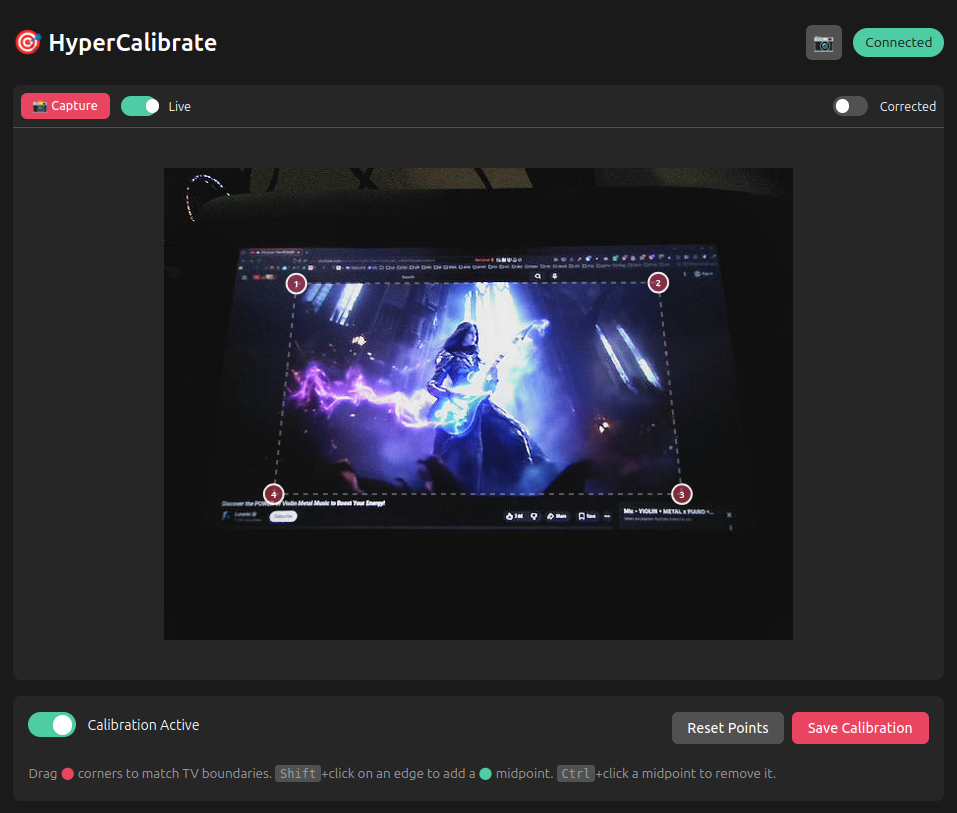
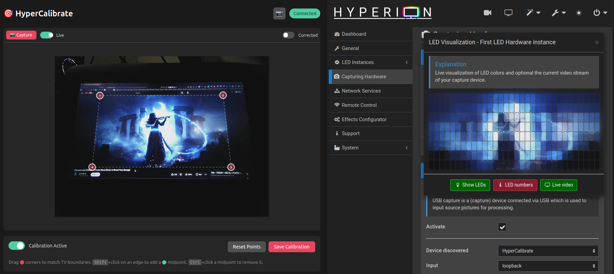
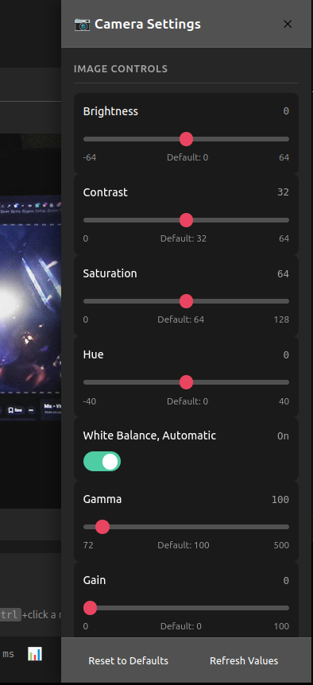

# HyperCalibrate

**Low-latency TV screen calibration for Hyperion ambient lighting systems.**

HyperCalibrate is a high-performance application designed to run on Raspberry Pi 5 (HyperBian) that:

- Captures video from a USB camera or **HDMI capture card**
- Provides a web-based calibration interface for mapping TV screen corners
- Applies real-time perspective correction (keystone adjustment)
- **Color correction** with auto white balance for accurate LED colors
- Outputs the corrected video to a virtual camera device for Hyperion to consume

## Features

- 🚀 **Low Latency**: Written in Rust for maximum performance
- 🌐 **Web UI**: Calibrate from your phone on the local network
- 🎯 **Dynamic Calibration**: 4 corners + add/remove edge points as needed
- ⚡ **Live Preview**: See calibration changes in real-time
- 💾 **Persistent Config**: Saves calibration data for automatic loading
- 📹 **Virtual Camera Output**: Creates a v4l2loopback device for Hyperion
- 🐳 **Docker Build**: Cross-compile for Raspberry Pi from any machine
- 🔧 **One-Command Deploy**: Build and deploy to HyperBian with a single command
- 🎨 **Color Correction**: Full color pipeline with presets for different sources
- ⚖️ **Auto White Balance**: One-click automatic color calibration (~80µs on Pi 5)
- 📺 **HDMI Capture Support**: Works with USB capture cards for HDMI input
- 🎛️ **Camera Controls**: Adjust brightness, contrast, saturation, and more
- 🔄 **Video Device Selection**: Choose between multiple video inputs from the UI




https://github.com/user-attachments/assets/63b4e111-1e47-4460-b328-d0b791985e12

## Quick Start (Recommended)

The easiest way to get started is to deploy directly to your HyperBian installation:

```bash
# Clone the repository
git clone https://github.com/instance-id/hypercalibrate.git
cd hypercalibrate

# Deploy to your Raspberry Pi (uses HyperBian default credentials)
./deploy.sh 192.168.1.100
```

This will:

1. Cross-compile the binary for Raspberry Pi using Docker
2. Copy the binary to your Pi via SSH
3. Install v4l2loopback and configure systemd
4. Start the service

Then open `http://192.168.1.100:8091` on your phone to calibrate!

## Requirements

### On Your Development Machine (for building)

- Docker (for cross-compilation)
- sshpass (installed automatically if missing)

### On Raspberry Pi

- HyperBian (or Raspberry Pi OS)
- USB Camera or HDMI Capture Card (V4L2 compatible)
- Hyperion/HyperHDR

## Installation Options

### Option 1: One-Command Deploy (Recommended)

```bash
# Deploy with HyperBian defaults (user: hyperion, pass: ambientlight)
./deploy.sh 192.168.1.100

# Or with custom credentials
./deploy.sh 192.168.1.100 -u pi -p raspberry
```

### Option 2: Using Configuration File

```bash
# Create your configuration
cp deploy.conf.example deploy.conf
nano deploy.conf  # Edit with your settings

# Deploy using config
./deploy.sh
```

### Option 3: Build Only, Deploy Later

```bash
# Just build the binary
./deploy.sh --build-only

# Binary will be at: dist/hypercalibrate
# Copy it and the install script to your Pi
scp dist/hypercalibrate scripts/install-rpi.sh pi@192.168.1.100:~/

# Then on the Pi, run the install script
ssh pi@192.168.1.100
sudo ./install-rpi.sh
```

### Option 4: Build on Raspberry Pi

```bash
# On the Pi, install Rust
curl --proto '=https' --tlsv1.2 -sSf https://sh.rustup.rs | sh
source ~/.cargo/env

# Clone and build
git clone https://github.com/instance-id/hypercalibrate.git
cd hypercalibrate
cargo build --release

# Install (optionally customize settings via environment variables)
# INPUT_DEVICE=/dev/video0 OUTPUT_DEVICE=/dev/video10 sudo -E ./scripts/install-rpi.sh
sudo ./scripts/install-rpi.sh
```

## Configuration

### Deploy Configuration (deploy.conf)

```bash
# Copy example and edit
cp deploy.conf.example deploy.conf
```

```bash
# Raspberry Pi connection
PI_IP=192.168.1.100
PI_USER=hyperion
PI_PASS=ambientlight

# Video devices
INPUT_DEVICE=/dev/video0    # Your USB camera
OUTPUT_DEVICE=/dev/video10  # Virtual camera for Hyperion

# Capture settings
CAPTURE_WIDTH=640
CAPTURE_HEIGHT=480
CAPTURE_FPS=30

# Web UI
WEB_PORT=8091
```

### Runtime Configuration (config.toml)

The calibration settings are stored on the Pi at `/etc/hypercalibrate/config.toml` and are updated automatically when you use the web UI.

## Usage

### Web Interface

1. Open `http://<raspberry-pi-ip>:8091` on your phone
2. You'll see a live preview from the camera
3. Drag the **corner markers** to the corners of your TV screen
4. **Shift+Click** on an edge to add a midpoint for curved/irregular edges
5. **Ctrl+Click** on a midpoint to remove it
6. Toggle "Show Corrected Output" to verify the transformation
7. Click **Save Calibration** to persist

### Hyperion Configuration

In Hyperion/HyperHDR:

1. Go to **Configuration → LED Hardware**
2. Under **LED Controller**, ensure your WLED device is configured
3. Go to **Capturing Hardware**
4. Add a **Platform Capture** or **V4L2** grabber
5. Select **HyperCalibrate** (`/dev/video10`) as the video device
6. Configure your LED layout as normal

### Color Correction

HyperCalibrate includes a full color correction pipeline to ensure accurate LED colors, especially important when using HDMI capture cards that may introduce color casts.

**Quick Setup:**
1. Open the web UI and click the **🎨 Color** button
2. Enable color correction with the toggle
3. Click **⚖️ Auto White Balance** for automatic calibration
4. Or select a preset matching your source (HD Standard, HDR, PC Gaming, etc.)

**Available Controls:**
- **Color Space**: BT.601 (SD), BT.709 (HD), BT.2020 (UHD/HDR)
- **Quantization Range**: Limited (16-235) or Full (0-255)
- **White Balance**: Auto or manual RGB gain adjustment
- **Software Adjustments**: Brightness, Contrast, Saturation, Hue, Gamma

**Presets:**
| Preset | Use Case |
|--------|----------|
| HD Standard (BT.709) | Most streaming services, Blu-ray, modern consoles |
| HDR Content (BT.2020) | Netflix HDR, Prime Video HDR, HDR gaming |
| PC/Gaming (Full Range) | PC output, consoles set to Full RGB |
| SD Legacy (BT.601) | DVDs, older content, retro consoles |

**Capture Format:**
For best color accuracy with HDMI capture cards, select **YUYV** format in Video Settings. This enables proper color matrix conversion. MJPEG is faster but uses hardware color conversion which may be less accurate.

### Using HDMI Capture Cards

HyperCalibrate works great with USB HDMI capture cards for capturing your TV/monitor output:

1. Connect your HDMI source → Capture Card → Raspberry Pi USB
2. The capture card appears as a V4L2 video device (e.g., `/dev/video0`)
3. Select the device in the web UI under **⚙️ Video Settings**
4. Enable **Color Correction** and run **Auto White Balance** to compensate for any color cast from the capture card

**Tips for HDMI Capture:**
- Use **YUYV** capture format for accurate color matrix control
- Run Auto White Balance with neutral/gray content on screen
- If you see a yellow tint, the capture card likely needs white balance adjustment
- Multiple capture devices? Run `sudo hypercalibrate-udev-setup` for persistent device names

### Service Management

```bash
# SSH into your Pi
ssh hyperion@192.168.1.100

# Check status
sudo systemctl status hypercalibrate

# View logs
sudo journalctl -u hypercalibrate -f

# Restart service
sudo systemctl restart hypercalibrate

# Stop service
sudo systemctl stop hypercalibrate
```

### Uninstall

```bash
./deploy.sh 192.168.1.100 --uninstall
```

## Architecture

```
┌─────────────────┐     ┌─────────────────┐     ┌──────────────┐
│  USB Camera or  │────▶│  HyperCalibrate │────▶│ Virtual Cam  │
│  HDMI Capture   │     │   (Rust App)    │     │ /dev/video10 │
│  /dev/video0    │     └────────┬────────┘     └──────┬───────┘
└─────────────────┘              │                     │
                        ┌────────▼────────┐    ┌───────▼───────┐
                        │    Web UI       │    │   Hyperion    │
                        │ (Calibration)   │    │   (LED Out)   │
                        └─────────────────┘    └───────────────┘
```

### Processing Pipeline

1. **Capture**: V4L2 reads frames from USB camera or HDMI capture card
2. **Color Correction**: Apply color space conversion, white balance, and adjustments
3. **Transform**: Apply perspective transformation using calibration points
4. **Output**: Write corrected frames to v4l2loopback device
5. **Preview**: JPEG frames served via web server for calibration UI

### Color Pipeline

```
Raw YUYV/MJPEG → Color Matrix (BT.601/709/2020) → Range Expansion → RGB Gain (WB) → Adjustments → Output
                      ↓                              ↓                  ↓              ↓
                 Color Space                   Limited→Full        Auto/Manual    Brightness
                 Conversion                    (16-235→0-255)      White Balance  Contrast, etc.
```

## Performance

Optimized for Raspberry Pi 5:

- Written in Rust with release optimizations (LTO, single codegen unit)
- Direct V4L2 memory-mapped buffer access
- Custom perspective transformation (no OpenCV dependency)
- Auto white balance calculation: ~80µs (sparse sampling)
- Color correction pipeline: <1ms overhead per frame
- ~2.7MB binary size

## Additional Images

<details open> <summary>Show Images</summary>





</details>

## Troubleshooting

### Camera not detected

```bash
# List available cameras
v4l2-ctl --list-devices

# Check camera capabilities
v4l2-ctl -d /dev/video0 --all
```

### v4l2loopback not working

```bash
# Check if module is loaded
lsmod | grep v4l2loopback

# Reload the module
# NOTE: Use exclusive_caps=0 to prevent Hyperion from crashing
sudo modprobe -r v4l2loopback
sudo modprobe v4l2loopback devices=1 video_nr=10 card_label="HyperCalibrate" exclusive_caps=0
```

### Hyperion crashes after installing HyperCalibrate

This is caused by `exclusive_caps=1` in v4l2loopback. Fix:

```bash
# Update modprobe config
echo "options v4l2loopback devices=1 video_nr=10 card_label=HyperCalibrate exclusive_caps=0" | sudo tee /etc/modprobe.d/v4l2loopback.conf

# Reload module
sudo modprobe -r v4l2loopback
sudo modprobe v4l2loopback devices=1 video_nr=10 card_label="HyperCalibrate" exclusive_caps=0

# Restart services (Hyperion first!)
sudo systemctl restart hyperion@hyperion.service
sudo systemctl restart hypercalibrate
```

### Service won't start

```bash
# Check logs
sudo journalctl -u hypercalibrate -n 50

# Try running manually
sudo /usr/local/bin/hypercalibrate --config /etc/hypercalibrate/config.toml
```

### Docker build fails

```bash
# Make sure Docker is running
docker info

# Try rebuilding the image
docker build -t hypercalibrate-cross -f Dockerfile.cross . --no-cache
```

### SSH connection fails

```bash
# Test connection manually
ssh hyperion@192.168.1.100

# Check if sshpass is installed
which sshpass || sudo apt install sshpass
```

## Command Reference

### deploy.sh

```bash
./deploy.sh [IP] [options]

Options:
  -u, --user USER      SSH username (default: hyperion)
  -p, --password PASS  SSH password (default: ambientlight)
  -P, --port PORT      SSH port (default: 22)
  -c, --config FILE    Load configuration from file
  --skip-build         Use existing binary in dist/
  --build-only         Only build, don't deploy
  --uninstall          Remove from Pi
  -h, --help           Show help
```

### docker-build.sh (Recommended)

Cross-compiles for Raspberry Pi using Docker. **No local toolchain required** - just Docker.

```bash
./docker-build.sh [target]

Targets:
  aarch64  64-bit (Raspberry Pi 4/5, default) # Only tested on RPI5
  armv7    32-bit (Raspberry Pi 2/3)          # Probably not recommended, if it runs at all
```

Use this when:
- You don't have cross-compilers installed locally
- You want a reproducible build environment
- You're on macOS or Windows (WSL)

### scripts/local-build.sh

Builds natively or cross-compiles using locally installed toolchains.

```bash
./scripts/local-build.sh [target] [profile]

Targets:
  native   Build for current machine (default)
  rpi      Cross-compile for Raspberry Pi (aarch64)
  armv7    Cross-compile for older Pi (32-bit)

Profiles:
  release  Optimized build (default)
  debug    Debug build with symbols
```

Use this when:
- Building natively on a Raspberry Pi
- You already have `aarch64-linux-gnu-gcc` or `arm-linux-gnueabihf-gcc` installed
- You prefer not to use Docker

**Note:** For cross-compilation, you'll need to install the appropriate toolchain:
```bash
# For aarch64 (Pi 4/5)
sudo apt install gcc-aarch64-linux-gnu

# For armv7 (older Pi)
sudo apt install gcc-arm-linux-gnueabihf
```

### scripts/install-rpi.sh

Manual installation script to run directly on the Raspberry Pi.

```bash
sudo ./scripts/install-rpi.sh

# Or with custom configuration via environment variables:
INPUT_DEVICE=/dev/video0 \
OUTPUT_DEVICE=/dev/video10 \
CAPTURE_WIDTH=640 \
CAPTURE_HEIGHT=480 \
CAPTURE_FPS=30 \
WEB_PORT=8091 \
sudo -E ./scripts/install-rpi.sh
```

Environment Variables:

- `INPUT_DEVICE` - USB camera device (default: /dev/video0)
- `OUTPUT_DEVICE` - Virtual camera device (default: /dev/video10)
- `CAPTURE_WIDTH` - Capture width in pixels (default: 640)
- `CAPTURE_HEIGHT` - Capture height in pixels (default: 480)
- `CAPTURE_FPS` - Target frame rate (default: 30)
- `WEB_PORT` - Web UI port (default: 8091)
- `WEB_HOST` - Web server bind address (default: 0.0.0.0)

### hypercalibrate

```bash
hypercalibrate [options]

Options:
  -i, --input PATH     Input video device (default: /dev/video0)
  -o, --output PATH    Output video device (default: /dev/video10)
  --width N            Capture width (default: 640)
  --height N           Capture height (default: 480)
  --fps N              Target FPS (default: 30)
  --host ADDR          Web server bind address (default: 0.0.0.0)
  -p, --port N         Web server port (default: 8091)
  -c, --config PATH    Configuration file (default: config.toml)
  -v, --verbose        Enable debug logging
  -h, --help           Show help
```

## API Endpoints

### Calibration

| Endpoint                     | Method | Description                   |
| ---------------------------- | ------ | ----------------------------- |
| `/`                          | GET    | Calibration web UI            |
| `/api/info`                  | GET    | System information            |
| `/api/calibration`           | GET    | Current calibration data      |
| `/api/calibration`           | POST   | Update all calibration points |
| `/api/calibration/point/:id` | POST   | Update single point           |
| `/api/calibration/point/:id` | DELETE | Remove an edge point          |
| `/api/calibration/point/add` | POST   | Add a new edge point          |
| `/api/calibration/reset`     | POST   | Reset to defaults             |
| `/api/calibration/save`      | POST   | Save to config file           |
| `/api/calibration/enable`    | POST   | Enable transformation         |
| `/api/calibration/disable`   | POST   | Disable transformation        |

### Preview

| Endpoint                     | Method | Description                   |
| ---------------------------- | ------ | ----------------------------- |
| `/api/preview`               | GET    | Corrected preview (JPEG)      |
| `/api/preview/raw`           | GET    | Raw camera preview (JPEG)     |
| `/api/preview/stream`        | GET    | MJPEG stream                  |
| `/api/preview/activate`      | POST   | Activate preview encoding     |
| `/api/preview/deactivate`    | POST   | Deactivate preview encoding   |

### Color Correction

| Endpoint                     | Method | Description                   |
| ---------------------------- | ------ | ----------------------------- |
| `/api/color`                 | GET    | Get color correction settings |
| `/api/color`                 | POST   | Update color settings         |
| `/api/color/presets`         | GET    | List available presets        |
| `/api/color/preset/:name`    | POST   | Apply a color preset          |
| `/api/color/auto-white-balance` | POST | Calculate and apply auto WB |

### Video Settings

| Endpoint                     | Method | Description                   |
| ---------------------------- | ------ | ----------------------------- |
| `/api/video/devices`         | GET    | List available video devices  |
| `/api/video/device`          | GET    | Get current input device      |
| `/api/video/device`          | POST   | Set input device (requires restart) |
| `/api/video/settings`        | GET    | Get resolution/FPS settings   |
| `/api/video/settings`        | POST   | Update video settings         |
| `/api/video/format`          | GET    | Get capture format (MJPEG/YUYV) |
| `/api/video/format`          | POST   | Set capture format            |

### Camera Controls

| Endpoint                     | Method | Description                   |
| ---------------------------- | ------ | ----------------------------- |
| `/api/camera/controls`       | GET    | Get available camera controls |
| `/api/camera/controls`       | POST   | Update camera control values  |
| `/api/camera/status`         | GET    | Get camera release status     |
| `/api/camera/release`        | POST   | Release camera for other apps |
| `/api/camera/acquire`        | POST   | Re-acquire camera             |

### System

| Endpoint                     | Method | Description                   |
| ---------------------------- | ------ | ----------------------------- |
| `/api/stats`                 | GET    | Performance statistics        |
| `/api/stats/reset`           | POST   | Reset statistics              |
| `/api/system/stats`          | GET    | System resource usage         |
| `/api/system/restart`        | POST   | Restart HyperCalibrate service |
| `/api/system/reboot`         | POST   | Reboot the Raspberry Pi       |

## License

MIT License - See [LICENSE](LICENSE) for details.

## Contributing

Contributions are welcome! Please feel free to submit a Pull Request.
